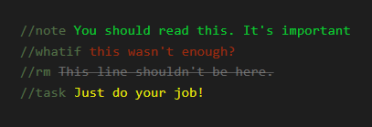
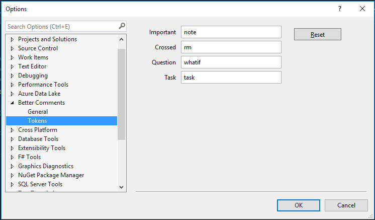
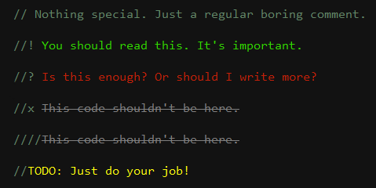
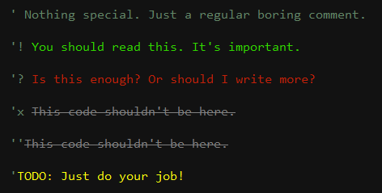
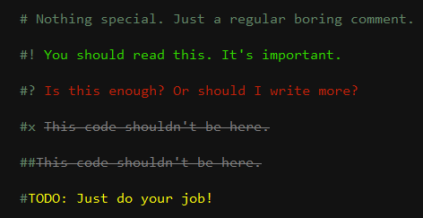
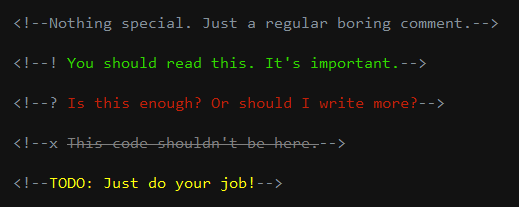
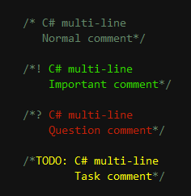
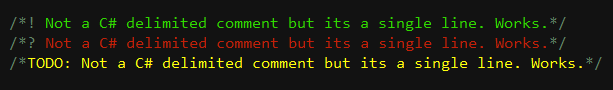

- **Branch vs16 :** VS2015, VS2017, and VS2019 on single vsix.
- **Branch vs17 :** VS2022 only.
---------------------------------------

# Better Comments Plus

**Better Comments Plus** is a Visual Studio extension that merges and extends two popular extensions — [Better Comments](https://github.com/omsharp/BetterComments) by Omar Rwemi and [Highlighter](https://github.com/daxpandhi/Highlighter) by Dax Pandhi — into a single, unified commenting solution.

It lets you customize comment font, opacity and size independently of the editor's font settings, and adds customizable comment classifications, each with its own configurable foreground and background styles.

Download this extension from the [Visual Studio Marketplace](https://marketplace.visualstudio.com/items?itemName=OmarRwemi.BetterCommentsVS2022).

---------------------------------------

## Project Origins

This project is a **merged fork** of:

- **[Better Comments](https://github.com/omsharp/BetterComments)** — Customizable comment foreground colors, font settings, and comment classifications
- **[Highlighter](https://github.com/daxpandhi/Highlighter)** — Text highlighting with configurable background colors, shapes, and blur effects

Both projects are licensed under [Apache 2.0](LICENSE). Original copyright notices are preserved in the LICENSE file.

## Features

- Additional comment classifications. Important, Question, Task, and Crossed. 
- Customizable foreground for each comment classification.
- Customize the font settings and opacity of your comments.
- Works with C#, F#, VB.NET, C/C++, JavaScript, Python, HTML, and XAML.

 

### Comment Classifications

- Use '!' for Important.
- Use '?' for Question.
- Use "Todo" (Case ignored) for Task.
- Use 'x', 'X', or double comment for strikethrough (Crossed).

Or you can use your own custom tokens:

C#, F#, C/C++, and JavaScript 

VB.NET 

Python 

HTML/XAML (**Works only with single-line comments**) 

Multiline delimited comments (**Works only in C#**).

Single-line delimited comments (**Works in C#, F#, C/C++, and JavaScript**)

 

### Custom Foreground & Background Color for each Rule

- You can set foreground and background colors for each rule independently.
- You can enable/disable foreground and background styling per rule.
- Background supports multiple shapes (Tag, Tag Under, Line, Line Under) with blur and transparency options.

   Go to Tools => Options => Better Comments Plus => Rules

 

### Independent Font Settings & More

- You can change the comments font settings without affecting the editor's font settings.
- You can add unlimited custom rules with custom matching criteria.
- You can drag and drop to reorder rule priorities.
- You can create Global rules (applied to all projects) or Solution rules (specific to the current solution).
- You can import and export rule configurations.

   Go to Tools => Options => Better Comments Plus => General / Rules

 

## Contribute
- Check out the [contribution guidelines](CONTRIBUTING.md)
if you want to contribute to this project.

- See the [changelog](CHANGELOG.md) for changes and roadmap.

 

## License
[Apache 2.0](LICENSE)